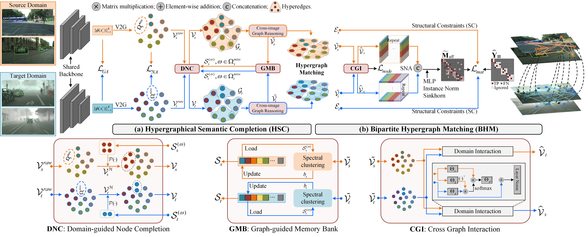

# [SIGMA++: Improved Semantic-complete Graph Matching for Domain Adaptive Object Detection (TPAMI 2023) (FRCNN-based Implementation)](./assets/manuscript.pdf)

[[Manuscript](./assets/manuscript.pdf)] [[知乎](https://zhuanlan.zhihu.com/p/492956292)]


 SIGMA++ has found its final home now, indicating the end of this series of works. The growth of SIGMA++ is full of frustration: 👶 ➡  🧒. 
 
 [SCAN](https://ojs.aaai.org/index.php/AAAI/article/view/20031) ➡ [SCAN++](https://ieeexplore.ieee.org/document/9931144/) ➡ [SIGMA](https://openaccess.thecvf.com/content/CVPR2022/papers/Li_SIGMA_Semantic-Complete_Graph_Matching_for_Domain_Adaptive_Object_Detection_CVPR_2022_paper.pdf) ➡ [SIGMA++](./assets/manuscript.pdf)

The main idea of the series of works: *Model fine-grained feature points with graphs.* We 
 sincerely appreciate for all the readers showing interest in our works. 

Honestly, due to the limited personal ability, our works still have many limitations, e.g., sub-optimal and redundant designs. Please forgive me. Nevertheless, we hope our works can inspire lots of good idea.


Best regards,\
[Wuyang Li](https://wymancv.github.io/wuyang.github.io/)\
E-mail: wuyangli2-c@my.cityu.edu.hk 


## 💡 Preparation

#### Philosophy
Graph (SIGMA):
- Structure: each edge connects two nodes.
- Convolution: message propagation in a point-to-point manner.
- Matching: quadratic constraints (edges).

Hypergraph (SIGMA++):
- Structure: each hyperedge connects several nodes.
- Convolution: message propagation in a grouping manner (within hyperedge).
- Matching: high-order constraints (hyperedges)

#### Datasets
Prepare required benchmark datasets following [DATASET.md](./docs/DATASETS.md). Almost all popular DAOD benchmarks are supported in this project.

#### Installation
Check [INSTALL.md](./docs/INSTALL.md) for installation instructions. Feel free to screenshot your issue for me if you meet some problems. Thanks.

## 📦 Well-trained Models

Faster RCNN C4 based implementation: city to foggy. You can find the model and log at [frcnn_city_to_foggy](https://portland-my.sharepoint.com/:f:/g/personal/wuyangli2-c_my_cityu_edu_hk/EvBHItGhXr9Csb0XTz3Hl2kBHWE8OG4Q1JYHlnbhOp7e9A?e=uAIx10), which is based on [DA-FRCNN](https://github.com/krumo/Domain-Adaptive-Faster-RCNN-PyTorch). 

We transfer the  [DA-FRCNN](https://github.com/krumo/Domain-Adaptive-Faster-RCNN-PyTorch) implementation in this project.

NOTE: We didn't carefully tune the hyper-paramteres for FRCNN-based implementation duo to the time limit. Moreover, we replace the feature points with ROI features for graph-based operation as exiting works, e.g., [GPA](https://github.com/ChrisAllenMing/GPA-detection).

Method | AP@50:95 | AP@50| AP@75 | APs |APm |APl|
| :-----:| :-----:|:----:| :----: | :----:| :----: |:-----:| 
FRCNN w GA| 19.3 | 38.4  |18.2 | 2.0 | 17.3|  40.7|
[SA-DAF](https://github.com/krumo/Domain-Adaptive-Faster-RCNN-PyTorch)  | 20.8  | 41.1  | 19.4  | 2.3  | 18.5  | 43.9  |
SIGMA++ | 23.2  | 43.5  |21.0  |2.4  |20.7  |47.0 |


## 🔥 Get Start
Train the model with the default setting (e.g., city to foggy):
```
python tools/train_frcnn_da.py \
        --config-file configs/sigma_plus_plus/city_to_foggy_res50.yaml \
```
Test the well-trained model (e.g., city to foggy):
```
python tools/test_net.py \
        --config-file configs/sigma_plus_plus/city_to_foggy_res50.yaml \
        MODEL.WEIGHT published_models/frcnn_city_to_foggy_res50_43_5_mAP.pth
```

## ✨ Quick Tutorials
1) See [doc_demo.yaml](./configs/doc_demo.yaml) for a quick understanding on APIs.
2) Hypergraph convolution is updated [here](/fcos_core/layers/transformer.py). Hypergraph matching is updated [here](./fcos_core/modeling/rpn/fcos/graph_matching_head.py). 
3) Graph matching is in this "middle layer": [graph_matching_head](./fcos_core/modeling/rpn/fcos/graph_matching_head.py). 
4) Node sampling is conducted together with fcos loss: [loss](./fcos_core/modeling/rpn/fcos/loss.py).
5) We modify the [trainer](https://github.com/CityU-AIM-Group/SIGMA/blob/main/fcos_core/engine/trainer.py) to meet the requirements of SIGMA.


## 📝 Citation 

If you think this work is helpful for your project, please give it a star and citation. We sincerely appreciate for your acknowledgments.

```BibTeX
@ARTICLE{li2023sigma_plus_plus,
  author={Li, Wuyang, Xinyu, Liu and Yuan, Yixuan},
  journal={IEEE Transactions on Pattern Analysis and Machine Intelligence}, 
  title={SIGMA++: Improved Semantic-complete Graph Matching for Domain Adaptive Object Detection}, 
  year={2023},
```
Relevant project:
```BibTeX
@inproceedings{li2022sigma,
  title={SIGMA: Semantic-complete Graph Matching for Domain Adaptive Object Detection},
  author={Li, Wuyang and Liu, Xinyu and Yuan, Yixuan},
  booktitle={CVPR},
  year={2022}
}
```
## 🤞 Acknowledgements 
We mainly appreciate for these good projects and their authors' hard-working.
- This work is based on [EPM](https://github.com/chengchunhsu/EveryPixelMatters). 
- The implementation of our anchor-free detector is from [FCOS](https://github.com/tianzhi0549/FCOS/tree/f0a9731dac1346788cc30d5751177f2695caaa1f), which highly relies on [maskrcnn-benchmark](https://github.com/facebookresearch/maskrcnn-benchmark).
- The style-transferred data is from [D_adapt](https://github.com/thuml/Transfer-Learning-Library/tree/dev-tllib/examples/domain_adaptation/object_detection). 
- The faster-rcnn-based implementation is based on [DA-FRCNN](https://github.com/krumo/Domain-Adaptive-Faster-RCNN-PyTorch). 
- The hypergraph convolution is based on [HGCN](https://github.com/iMoonLab/HGNN)

## 📒 Abstract

Domain Adaptive Object Detection (DAOD) generalizes the object detector from an annotated domain to a label-free novel one. Recent works estimate prototypes (class centers) and minimize the corresponding distances to adapt the cross-domain class conditional distribution. However, this prototype-based paradigm 1) fails to capture the class variance with agnostic structural dependencies, and 2) ignores the domain-mismatched classes with a sub-optimal adaptation. To address these two challenges, we propose an improved SemantIc-complete Graph MAtching framework, dubbed SIGMA++, for DAOD, completing mismatched semantics and reformulating adaptation with hypergraph matching. Specifically, we propose a Hypergraphical Semantic Completion (HSC) module to generate hallucination graph nodes in mismatched classes. HSC builds a cross-image hypergraph to model class conditional distribution with high-order dependencies and learns a graph-guided memory bank to generate missing semantics. After representing the source and target batch with hypergraphs, we reformulate domain adaptation with a hypergraph matching problem, i.e., discovering well-matched nodes with homogeneous semantics to reduce the domain gap, which is solved with a Bipartite Hypergraph Matching (BHM) module. Graph nodes are used to estimate semantic-aware affinity, while edges serve as high-order structural constraints in a structure-aware matching loss, achieving fine-grained adaptation with hypergraph matching. The applicability of various object detectors verifies the generalization, and extensive experiments on nine benchmarks show its state-of-the-art performance on both AP50 and adaptation gains.


